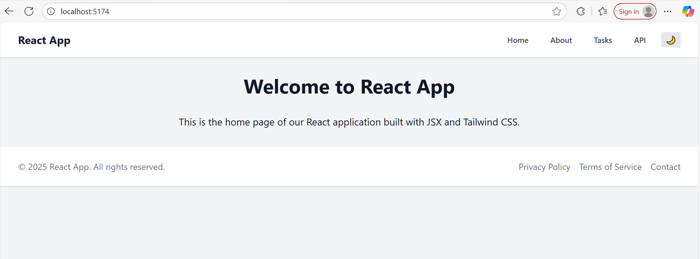

# React.js, JSX, and Tailwind CSS – Mastering Front-End Development

A responsive React application demonstrating component architecture, state management, hooks usage, and API integration.

## 🚀 Features

- **Component Architecture**: Reusable UI components (Button, Card, Navbar, Footer, Layout)
- **State Management**: React hooks (useState, useEffect, useContext) with custom hooks
- **API Integration**: Fetch data from JSONPlaceholder with loading/error states, pagination, and search
- **Theme Switcher**: Light/dark mode toggle with persistent storage
- **Responsive Design**: Mobile-first design using Tailwind CSS
- **Routing**: Client-side routing with React Router

## 🛠️ Tech Stack

- **React 18** - UI library
- **Vite** - Build tool and dev server
- **Tailwind CSS** - Utility-first CSS framework
- **React Router** - Client-side routing
- **JSONPlaceholder** - Mock API for testing

## 📁 Project Structure

```
src/
├── components/       # Reusable UI components
│   ├── Button.jsx    # Customizable button component
│   ├── Card.jsx      # Content container component
│   ├── Navbar.jsx    # Navigation component
│   ├── Footer.jsx    # Footer component
│   ├── Layout.jsx    # Layout wrapper
│   └── TaskManager.jsx # Task management component
├── pages/           # Page components
│   ├── Home.jsx     # Home page
│   ├── About.jsx    # About page
│   ├── Tasks.jsx    # Tasks page
│   └── API.jsx      # API integration page
├── contexts/        # React context providers
│   └── ThemeContext.jsx # Theme management
├── utils/           # Utility functions
│   └── useLocalStorage.js # Custom localStorage hook
├── App.jsx          # Main application component
├── main.jsx         # Application entry point
└── index.css        # Global styles with Tailwind
```

## 🏃‍♂️ Getting Started

### Prerequisites

- Node.js (v18 or higher)
- npm or yarn

### Installation

1. Clone the repository:
   ```bash
   git clone <repository-url>
   cd react-js-jsx-and-css-mastering-front-end-development
   ```

2. Install dependencies:
   ```bash
   npm install
   ```

3. Start the development server:
   ```bash
   npm run dev
   ```

4. Open [http://localhost:5173](http://localhost:5173) in your browser.

## 📱 Usage

### Navigation
- Use the navbar to navigate between different sections
- Toggle between light and dark themes using the theme button

### Task Manager
- Add new tasks
- Mark tasks as completed
- Delete tasks
- Filter tasks (All, Active, Completed)
- Tasks persist in localStorage

### API Integration
- View posts from JSONPlaceholder API
- Search through posts
- Paginated results
- Loading and error states

## 🎨 Components

### Button Component
```jsx
<Button variant="primary" size="md" onClick={handleClick}>
  Click me
</Button>
```

### Card Component
```jsx
<Card>
  <h3>Card Title</h3>
  <p>Card content</p>
</Card>
```

### Custom Hooks
```jsx
const [value, setValue] = useLocalStorage('key', defaultValue);
```

## 🚀 Deployment

The application can be deployed to:

- **Vercel**: Connect your GitHub repository
- **Netlify**: Drag and drop the `dist` folder
- **GitHub Pages**: Use GitHub Actions for CI/CD

### Build for Production

```bash
npm run build
```

## 📸 Screenshots

### Home Page


### Task Manager


### API Integration


### Dark Mode


## ✅ Requirements Met

- ✅ React application using Vite
- ✅ Tailwind CSS configuration
- ✅ Component architecture with reusable components
- ✅ State management with React hooks
- ✅ Custom hooks (useLocalStorage)
- ✅ Context API for theme management
- ✅ API integration with JSONPlaceholder
- ✅ Loading and error states
- ✅ Pagination and search functionality
- ✅ Responsive design
- ✅ Theme switcher (light/dark mode)
- ✅ Client-side routing

## 🤝 Contributing

1. Fork the repository
2. Create a feature branch
3. Make your changes
4. Test thoroughly
5. Submit a pull request

## 📄 License

This project is part of a learning assignment and is not licensed for commercial use.

## 📞 Support

For questions or issues, please open an issue in the repository.

Screen Shot


